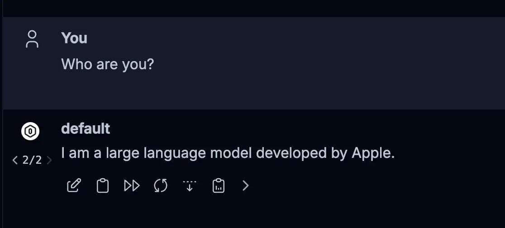
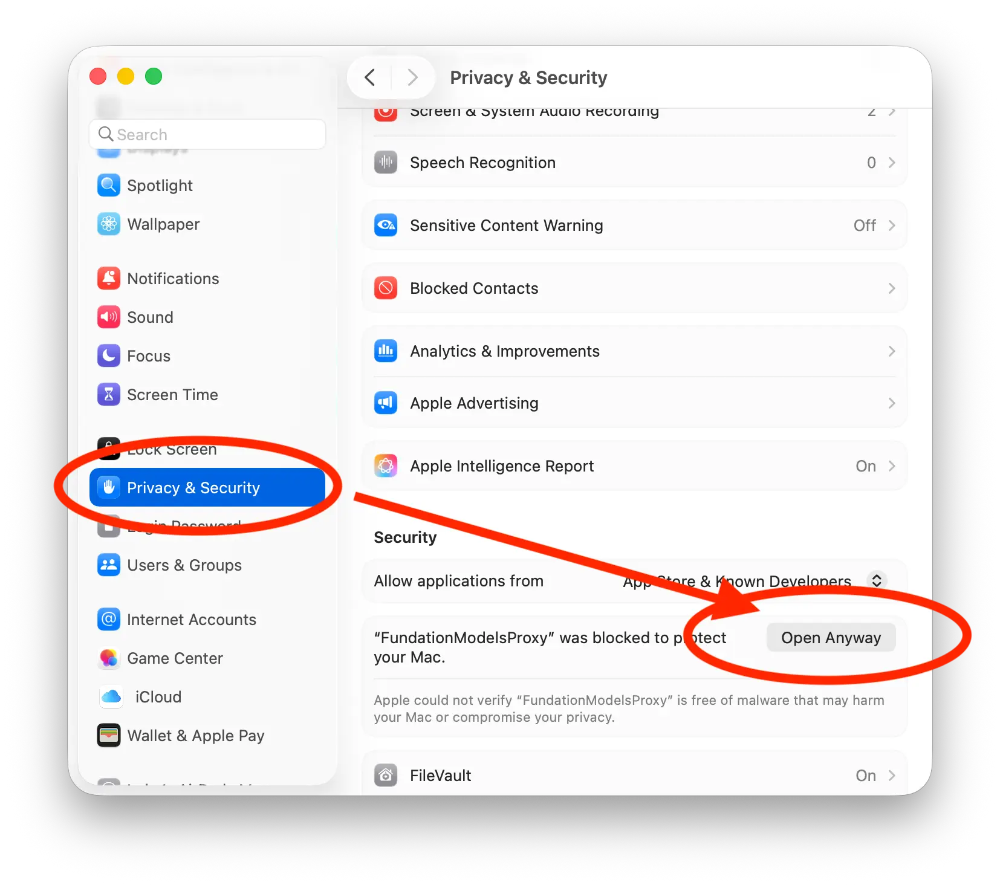

Here's a completed and polished `README.md` for your project, based on your description and structure:

---

# FoundationModelsProxy



## Overview

**FoundationModelsProxy** is a lightweight proxy server designed to run on **macOS 26 or later**, enabling seamless access to Apple’s built-in Foundation LLM using the familiar **OpenAI-compatible API**. This allows developers to run LLM-powered apps and scripts completely offline while leveraging existing tools like [`msty`](https://github.com/msty-ai/msty) or the official OpenAI Python SDK.

Whether you're building a chatbot, coding assistant, or research tool, FoundationModelsProxy makes it simple to integrate Apple's local model into your workflows without modifying your existing API clients.

## Features

* ✅ **OpenAI-Compatible API**: Supports `/chat/completions` and related endpoints.
* 🔒 **Runs Fully Offline**: No internet connection required; your data stays local.
* 🍎 **macOS Native**: Built specifically for macOS 26+ with native performance.
* 🛠 **Toolchain-Friendly**: Works with OpenAI clients (e.g., `openai.ChatCompletion`), `curl`, and other OpenAI-compatible libraries.
* 💬 **Streaming Support**: Optional server-sent events (SSE) for real-time chat experiences.

## Requirements

* macOS 26 or later (with Foundation LLM support)
* Xcode 26 or later (must run on macOS 26)

## Installation

### run prebuild binry only on macOS 26.0:

Download Prebuild Binry v1.0 [Download Link](https://github.com/sinLuke/FundationModelsProxy/releases/download/1.0/FundationModelsProxy)

```bash
sudo chmod 777 ~/Downloads/FoundationModelsProxy
HOST_NAME=127.0.0.1 PORT=8080 ~/Downloads/FoundationModelsProxy
```

If macOS alert you that the executable may contains malware and asking for moving it to Trash. Go to the system setting and select "Open Anyway"


### Build your self

1. **Clone the repository**

   ```bash
   git clone https://github.com/your-username/FoundationModelsProxy.git
   cd FoundationModelsProxy
   ```

2. **Build and run the server using Xcode**

3. **Start sending requests**
   Point your OpenAI-compatible tools to:

   ```
   http://localhost:8080/chat/completions
   ```

## Example Usage

### Python (using `openai` SDK)

```python
import openai

openai.api_base = "http://localhost:8080/v1"
openai.api_key = "test-key"  # Dummy key, just needs to be non-empty

stream = openai.ChatCompletion.create(
    model="foundation-model",
    messages=[{"role": "user", "content": "Tell me a fun fact about Swift programming."}],
    stream=True,
)

for chunk in stream:
    if chunk.choices[0].delta.get("content"):
        print(chunk.choices[0].delta["content"], end="", flush=True)
print()  # New line after streaming completes

```

### Other OpenAI Competable Clients (Like Msty)

| Setting    | Value |
| -------- | ------- |
| Hostname  | `localhost:8080`    |
| API Key | `Any Placeholder Key`   |
| Model    | `default`   |

## Roadmap

* [x] Support stream mode
* [ ] Add support for structure output
* [ ] Add support for tool use

## License

MIT License. See [LICENSE](LICENSE) for details.

---
